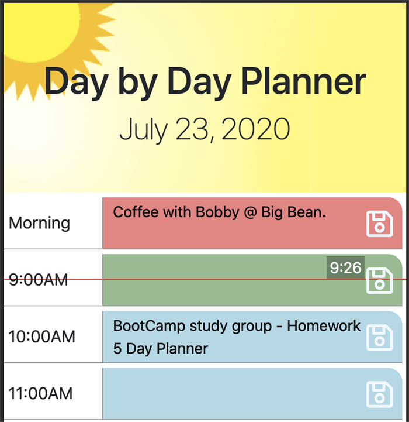

# Day-By-Day Planner
A lesson in presence. Day By Day planner, a day planner for the current day. No planning for tomorrow or wasting time on the past. Keep your day organized at a glance with the Day by Day planner.

Eliminate the stress by focussing on today. Get control of your schedule and relax with Day By Day Planner, the stylish, attractive, easy-to-use today only scheduler.

- View the app here - https://keiththarp.github.io/day-by-day-planner/

## Technologies Used to Create Day-By-Day
* HTML
* CSS
* JavaScript
* Jquery
* Moment.JS

## Early Steps

I began by acquainting myself with Moment.JS and practicing with it as well as Jquery with some simple exercises and console.log experiments. 

## Lessons In Coding

After getting my MVP set up and deployed, I worked on fine-tuning the code and add a couple features I had in mind. This process helped me familiarize myself with building html elements on the fly with JavaScript/Jquery. Several fun logic problems to work through, especially with the bonus items like clearing the calendar each day and setting the sliding clock.

**Updating colors**

- Getting used to Moment.JS was the biggest hurdle here. My early attempts had a lot of confusing and unnecessary code. My late iterations including dynamically updating colors without need for refresh.

**Saving the plan**

- This was a great opportunity to reinforce what I learned in the last homework assignment with regards to local storage.

**Mobile First design**

- Using the BootStrap framework helps make the design and final product a mobile friendly app from the beginning.

**Acknowledgments and Credits**

* Thanks to Scott, Mike, & Bobby for being a great and ever patient education team!
* Thanks to Tiffany for inspiring me to dig deeper into the Moment.JS docs and to take more advantage of the tool!
* Thanks to Molly for pointing me toward the correct rock to look under for my time block updating issue!
* Tons of thanks to the several different study groups that helped keep the problem solving juices flowing this week.

## MIT License

Copyright (c)

Permission is hereby granted, free of charge, to any person obtaining a copy
of this software and associated documentation files (the "Software"), to deal
in the Software without restriction, including without limitation the rights
to use, copy, modify, merge, publish, distribute, sublicense, and/or sell
copies of the Software, and to permit persons to whom the Software is
furnished to do so, subject to the following conditions:

The above copyright notice and this permission notice shall be included in all
copies or substantial portions of the Software.

THE SOFTWARE IS PROVIDED "AS IS", WITHOUT WARRANTY OF ANY KIND, EXPRESS OR
IMPLIED, INCLUDING BUT NOT LIMITED TO THE WARRANTIES OF MERCHANTABILITY,
FITNESS FOR A PARTICULAR PURPOSE AND NONINFRINGEMENT. IN NO EVENT SHALL THE
AUTHORS OR COPYRIGHT HOLDERS BE LIABLE FOR ANY CLAIM, DAMAGES OR OTHER
LIABILITY, WHETHER IN AN ACTION OF CONTRACT, TORT OR OTHERWISE, ARISING FROM,
OUT OF OR IN CONNECTION WITH THE SOFTWARE OR THE USE OR OTHER DEALINGS IN THE
SOFTWARE.

